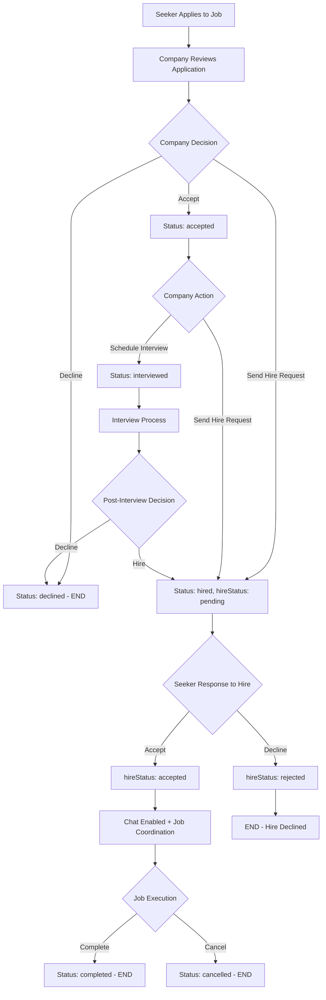

# 🎯 Complete Hire Request Workflow

## **📋 Postman Testing Guide**

### **Step 1: Company Sends Hire Request**
```bash
PUT {{baseUrl}}/api/applications/{{applicationId}}/hire
Authorization: Bearer {{companyToken}}
Content-Type: application/json

# No body required
```

**Response Example:**
```json
{
  "success": true,
  "message": "Hire request sent successfully",
  "data": {
    "id": "Y7F9ob4llzUZl3okSgAy",
    "status": "hired",
    "hireStatus": "pending",
    "hireRequestedAt": "2024-01-15T14:30:00Z"
  }
}
```

### **Step 2: Seeker Responds to Hire Request**

**Accept Hire Request:**
```bash
PUT {{baseUrl}}/api/applications/{{applicationId}}/hire-response
Authorization: Bearer {{seekerToken}}
Content-Type: application/json

{
  "response": "accepted"
}
```

**Decline Hire Request:**
```bash
PUT {{baseUrl}}/api/applications/{{applicationId}}/hire-response
Authorization: Bearer {{seekerToken}}
Content-Type: application/json

{
  "response": "rejected"
}
```

**Response Example:**
```json
{
  "success": true,
  "message": "Hire request response submitted successfully",
  "data": {
    "id": "Y7F9ob4llzUZl3okSgAy",
    "status": "hired",
    "hireStatus": "accepted",
    "hireRespondedAt": "2024-01-15T15:45:00Z"
  }
}
```

---

## **🔄 Complete Workflow Diagram**



---

## **📱 Frontend Implementation**

### **✅ Seeker Application Details Screen**
**File:** `app/(seeker)/application/[id].tsx`

**Key Features:**
1. **Hire Request Detection:** Shows when `status === 'hired'` and `hireStatus === 'pending'`
2. **Accept/Decline Buttons:** Clean UI with confirmation dialogs
3. **Status Display:** Shows seeker's response after they've responded
4. **Next Steps:** Guides seeker on what to do after accepting

**UI Components:**
- **Hire Request Section:** Green bordered container with company message
- **Action Buttons:** Accept (green) and Decline (red outline) buttons  
- **Response Status:** Shows "You accepted/declined" with timestamp
- **Next Steps:** Chat coordination instructions

### **✅ My Shifts Screen Enhancement**
**File:** `app/(seeker)/(tabs)/my-shifts.tsx`

**Status Indicators:**
- **Hired (Pending Response):** Orange badge with "Action Needed"
- **Hired (Accepted):** Green badge with "Active"
- **Hired (Declined):** Red badge with "Declined"

---

## **🎯 Application Status Flow**

### **Status Transitions:**
1. **applied** → Company can `accept`, `decline`, or `hire`
2. **accepted** → Company can `hire` or schedule interview
3. **interviewed** → Company can `hire` or `decline`
4. **hired** → Seeker can `accept` or `reject` hire request
5. **completed/cancelled** → Final states

### **Hire Status Values:**
- **pending:** Company sent hire request, waiting for seeker response
- **accepted:** Seeker accepted the hire request
- **rejected:** Seeker declined the hire request

---

## **🛠️ Backend Implementation**

### **✅ Existing Endpoints:**
```javascript
// Send hire request (Company)
PUT /api/applications/:applicationId/hire

// Respond to hire request (Seeker)  
PUT /api/applications/:applicationId/hire-response
Body: { "response": "accepted" | "rejected" }

// Get application details (Both)
GET /api/applications/:applicationId
```

### **✅ Database Fields:**
```javascript
// JobApplication model fields
{
  status: 'hired',
  hireStatus: 'pending' | 'accepted' | 'rejected',
  hireRequestedAt: '2024-01-15T14:30:00Z',
  hireRespondedAt: '2024-01-15T15:45:00Z'
}
```

---

## **📊 Business Logic**

### **Access Control:**
- ✅ **Companies:** Can only hire for their own job applications
- ✅ **Seekers:** Can only respond to hire requests for their own applications
- ✅ **Enhanced company membership check:** Users can act on behalf of their company

### **Validation Rules:**
- ✅ Hire request can only be sent for applications in status: `applied`, `accepted`, `interviewed`
- ✅ Seeker can only respond to hire requests with `hireStatus: pending`
- ✅ Response must be exactly `"accepted"` or `"rejected"`

### **Automatic Actions:**
- ✅ **History Tracking:** All hire actions logged in ApplicationHistory
- ✅ **Chat Creation:** Enabled when hire request is accepted
- ✅ **Notifications:** Sent to both parties on status changes

---

## **🧪 Testing Scenarios**

### **Happy Path:**
1. ✅ Company sends hire request → Status becomes `hired`, `hireStatus: pending`
2. ✅ Seeker accepts → `hireStatus: accepted`, chat enabled
3. ✅ Job coordination begins → Eventually `completed`

### **Edge Cases:**
1. ✅ Seeker declines → `hireStatus: rejected`, process ends
2. ✅ Company from different organization → 403 Forbidden
3. ✅ Invalid hire response → 400 Bad Request
4. ✅ Already responded → Prevents duplicate responses

### **Error Handling:**
1. ✅ Application not found → 404 Not Found
2. ✅ Invalid application status → 400 Bad Request  
3. ✅ Unauthorized access → 403 Forbidden
4. ✅ Server errors → 500 Internal Server Error

---

## **🚀 Ready to Test!**

The complete hire request/response workflow is now implemented:

### **Backend:** ✅ Fully implemented and tested
### **Frontend:** ✅ Seeker can accept/decline hire requests
### **UI/UX:** ✅ Clean, intuitive interface with confirmations
### **Testing:** ✅ Postman endpoints ready for testing

**Next Steps:**
1. Test with Postman using the endpoints above
2. Test frontend flow in seeker app
3. Verify chat creation after hire acceptance
4. Test job completion workflow