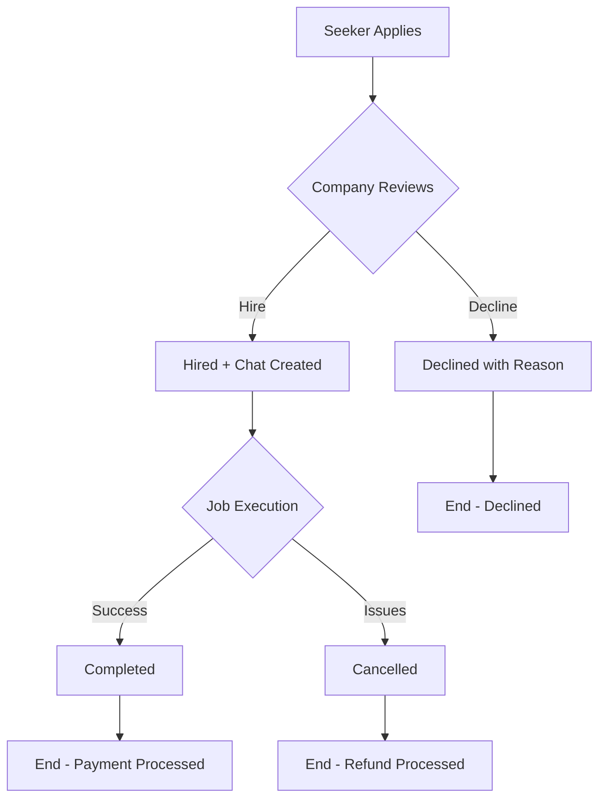
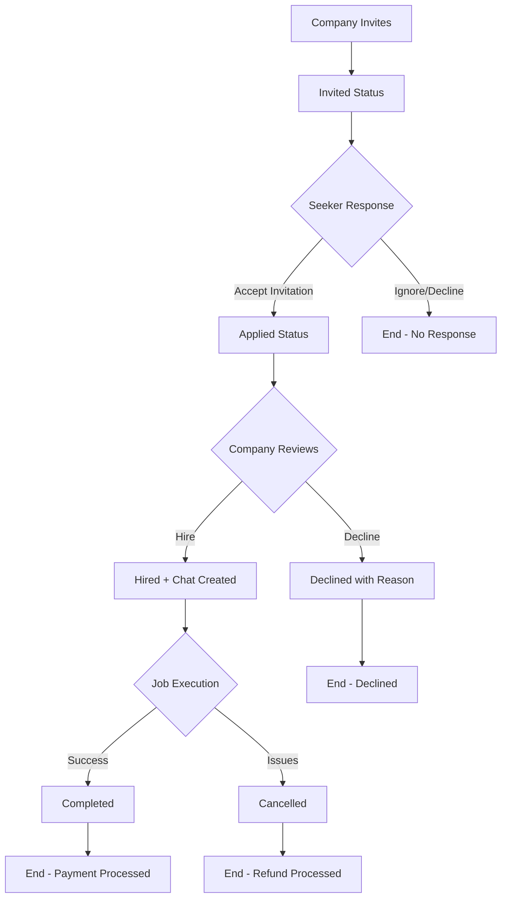

# Job Application Workflow Documentation

## **Overview**
This document outlines the complete job application workflow in the Shift platform, covering all interactions between job seekers and companies from application to completion.

## **Prerequisites**
- ✅ **Seeker Profile**: Job seeker has completed their profile
- ✅ **Company Profile**: Company has set up their profile
- ✅ **Job Posted**: Company has created and published a job

---

## **🔄 Complete Application Workflow**

### **Phase 1: Application Initiation**

#### **Scenario A: Seeker Applies to Job**
```
1. Seeker finds job → 2. Reviews job details → 3. Applies to job
```

**API Call:**
```bash
POST /api/jobs/:jobId/apply
{
  "availability": "Weekends and evenings"
}
```

**Response:** Complete data including seeker profile, job details, and company info

#### **Scenario B: Company Invites Seeker**
```
1. Company searches seekers → 2. Views seeker profile → 3. Sends invitation
```

**API Call:**
```bash
POST /api/jobs/:jobId/invite/:seekerId
```

**Response:** Invitation created with status `"invited"`

---

### **Phase 2: Two Different Scenarios**

## **🔄 Scenario A: Seeker Applied to Job**

#### **Company Reviews Applications**
```
GET /api/jobs/:jobId/applications
```

#### **Company Decision - Direct Hire or Decline:**

##### **✅ Option 1: Hire Directly (Skip Accept Step)**
```bash
PUT /api/applications/:applicationId/hire
```

**What Happens:**
- Status changes from `"applied"` → `"hired"`
- Payment process initiated
- Chat room created
- History recorded

##### **❌ Option 2: Decline Application**
```bash
PUT /api/applications/:applicationId/decline
{
  "reason": "Another candidate selected"
}
```

**Available Decline Reasons:**
- `"Another candidate selected"`
- `"Not the right fit"`
- `"Limited experience"`
- `"Position filled"`

**What Happens:**
- Status changes to `"declined"`
- Seeker gets notification with reason
- History recorded

---

## **🔄 Scenario B: Company Invited Seeker**

#### **Step 1: Company Sends Invitation**
```bash
POST /api/jobs/:jobId/invite/:seekerId
```

**Status:** `"invited"`

#### **Step 2: Seeker Accepts Invitation**
```bash
PUT /api/applications/:applicationId/accept-invitation
```

**What Happens:**
- Status changes from `"invited"` → `"applied"`
- Now follows Scenario A workflow

#### **Step 3: Company Decision (Same as Scenario A)**

##### **✅ Option 1: Hire**
```bash
PUT /api/applications/:applicationId/hire
```

##### **❌ Option 2: Decline**
```bash
PUT /api/applications/:applicationId/decline
{
  "reason": "Not the right fit"
}
```

---

### **Phase 3: Hiring Process**

#### **For Instant Hire Jobs:**
```bash
PUT /api/applications/:applicationId/hire
```

**What Happens:**
- Status changes to `"hired"`
- Hire request sent to seeker
- Payment process initiated
- History recorded

#### **For Interview First Jobs:**
```bash
PUT /api/applications/:applicationId/interview
{
  "interviewDate": "2024-01-20",
  "interviewTime": "14:30",
  "interviewType": "in-person",
  "location": "McDonald's Muscat Grand Mall",
  "notes": "Bring your CV and ID"
}
```

**What Happens:**
- Status changes to `"interviewed"`
- **Chat room automatically created**
- Interview details sent to seeker
- History recorded

---

### **Phase 4: Job Completion**

#### **Complete Job Successfully**
```bash
PUT /api/applications/:applicationId/complete
{
  "feedback": "Excellent performance throughout the shift",
  "rating": 5,
  "notes": "Punctual and professional"
}
```

**Who Can Complete:**
- ✅ Company (after seeker finishes work)
- ✅ Seeker (after completing work)

**What Happens:**
- Status changes to `"completed"`
- Payment processed
- Ratings exchanged
- History recorded

#### **Cancel Job**
```bash
PUT /api/applications/:applicationId/cancel
{
  "reason": "Event was cancelled by client",
  "notes": "External circumstances"
}
```

**Who Can Cancel:**
- ✅ Company (business reasons)
- ✅ Seeker (personal reasons)

**What Happens:**
- Status changes to `"cancelled"`
- Refund/compensation processed if applicable
- History recorded

---

## **📊 Application Status Flow**

### **Scenario A: Seeker Applied**


### **Scenario B: Company Invited**


---

## **🎯 Business Rules**

### **Application Rules**
- ✅ One application per seeker per job
- ✅ Companies can invite multiple seekers
- ✅ Seekers can apply to multiple jobs
- ✅ Blocked seekers cannot apply

### **Status Transitions**
- `applied` → `accepted` or `declined`
- `accepted` → `hired` or `declined`
- `interviewed` → `hired` or `declined`  
- `hired` → `completed` or `cancelled`
- `invited` → `applied` (when seeker accepts invitation)

### **Chat Creation Triggers**
- ✅ Application accepted
- ✅ Interview scheduled
- ❌ Not created for declined applications

### **Payment Processing**
- **Instant Hire**: Payment on hire
- **Interview First**: Payment on completion
- **Cancellation**: Refund based on timing

---

## **📱 API Endpoints Summary**

### **Core Application Flow**
```bash
# Seeker applies
POST /api/jobs/:jobId/apply

# Company invites seeker  
POST /api/jobs/:jobId/invite/:seekerId

# Company reviews applications (with complete seeker data)
GET /api/jobs/:jobId/applications

# Company accepts (creates chat)
PUT /api/applications/:applicationId/accept

# Company declines with reason
PUT /api/applications/:applicationId/decline

# Company hires seeker
PUT /api/applications/:applicationId/hire

# Schedule interview (creates chat)
PUT /api/applications/:applicationId/interview

# Complete job
PUT /api/applications/:applicationId/complete

# Cancel job
PUT /api/applications/:applicationId/cancel
```

### **View Applications**
```bash
# Seeker views their applications (with complete job/company data)
GET /api/applications

# Get specific application details
GET /api/applications/:applicationId

# Check application status for specific job
GET /api/jobs/:jobId/application-status
```

---

## **📈 Data Returned**

### **Complete Application Data Structure**
Every API response includes:

```javascript
{
  // Basic application info
  "id": "app123",
  "applicationId": "APP-ABC123",
  "status": "applied",
  "appliedAt": "2024-01-15T10:00:00Z",
  
  // COMPLETE SEEKER DATA
  "seeker": {
    "fullName": "Ahmad Hassan",
    "profilePhoto": "url...",
    "profileVideo": "url...",
    "skills": ["Customer Service", "Cashier"],
    "experience": "2 years",
    "languages": ["Arabic", "English"],
    "rating": 4.5,
    "totalJobsAppliedTo": 15,
    "numberOfHires": 8,
    "isVerified": true
  },
  
  // COMPLETE JOB DATA
  "job": {
    "roleName": "Cashier",
    "jobSummary": "Cashier needed for weekend shifts",
    "payPerHour": 3.5,
    "hiringType": "Instant Hire",
    "shiftTypes": ["Morning", "Evening"],
    "requiredSkills": ["Customer Service"],
    "genderPreference": "Both"
  },
  
  // COMPLETE COMPANY DATA
  "company": {
    "companyName": "McDonald's Oman",
    "companyLogo": "url...",
    "rating": 4.2,
    "isVerified": true,
    "locationData": {
      "brand": "McDonald's",
      "address": "Muscat Grand Mall",
      "governorate": "Muscat"
    }
  },
  
  // Application details
  "availability": "Weekends",
  
  // Chat info (if applicable)
  "chatId": "chat456",
  "chatInitiated": true,
  
  // Status history
  "statusChangedAt": "2024-01-15T11:30:00Z"
}
```

---

## **🔍 History Tracking**

Every action is automatically tracked:

```javascript
{
  "historyId": "HIST-XYZ789",
  "action": "accepted",
  "fromStatus": "applied",
  "toStatus": "accepted", 
  "actionBy": "company",
  "actionById": "company123",
  "reason": "Good fit for the role",
  "notes": "Impressive profile and experience",
  "actionAt": "2024-01-15T11:30:00Z",
  "ipAddress": "192.168.1.1"
}
```

**Tracked Actions:**
- `applied`, `invited`, `accepted`, `declined`
- `hired`, `interviewed`, `completed`, `cancelled`

---

## **💡 Developer Notes**

### **Key Benefits**
1. **Single API Call**: Get complete application data in one request
2. **Automatic Data Population**: No need to make separate calls for seeker/job/company data
3. **History Tracking**: Full audit trail of all application changes
4. **Chat Integration**: Automatic chat creation on acceptance/interview
5. **Business Logic**: Built-in validation and workflow enforcement

### **Backward Compatibility**
- ✅ All existing endpoints work unchanged
- ✅ Response format extended (not changed)
- ✅ No breaking changes to existing frontend code

### **Error Handling**
- Detailed error messages with validation details
- Proper HTTP status codes
- Development vs production error modes

This workflow ensures a smooth experience for both job seekers and companies while maintaining complete data integrity and audit trails.